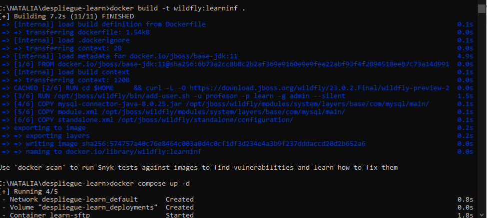
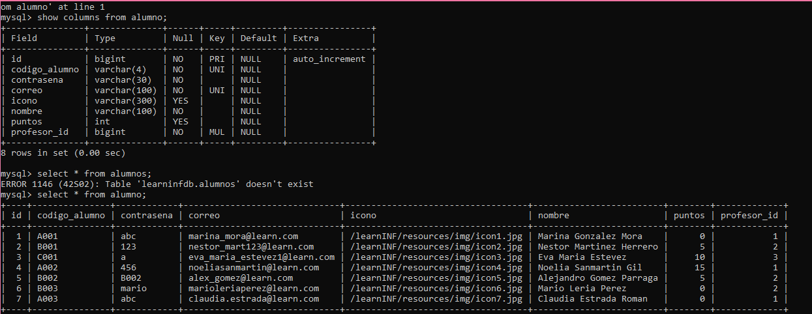
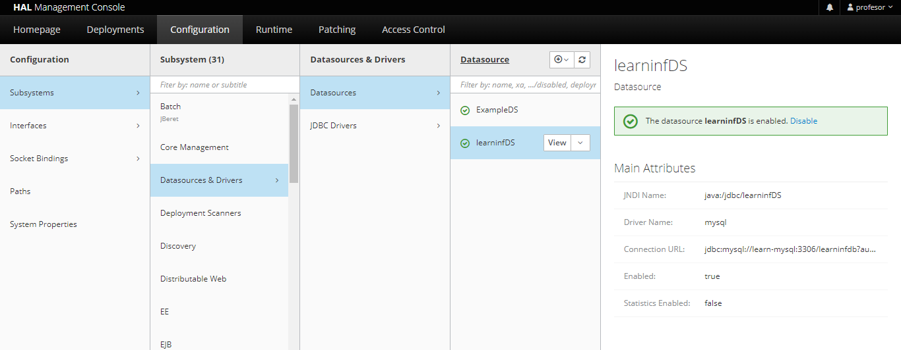

# Proyecto de fin de grado: 
## Documentación del desarrollo del TFG

*Realizado por Natalia Cristóbal Rodríguez - 2ºDAW*

## ¿Qué es Learn-INF?

“Learn-INF” consiste en una web interactiva para niños con el objetivo de que aprendan los principios básicos de la programación. Con una dinámica parecida a un videojuego de preguntas y respuestas, pero con logros y un diseño dinámico para ellos. El nombre es una combinación de la palabra “Learn”, cuyo significado es aprender en inglés, y de la abreviatura “INF”, la cual procede de INFormation. El planteamiento inicial sería:

 - La web dispone de distintos “mundos” con temáticas relacionadas con la programación y sus lenguajes. Estos a su vez se dividen en niveles, donde se aumenta su dificultad según se vaya avanzando.
 - Los niveles contienen lecciones y tests. Cada test se compone de preguntas que hará que el usuario consiga puntos para el desbloqueo de siguientes niveles y de recompensas extra (iconos de usuario, diplomas, trofeos…). Cada nivel y mundo tendrá una característica de desbloqueo. 
  - Los usuarios dispondrán de un panel personal con su información y logros. Entre las distintas vistas de la web se comprobará el usuario que tenga la sesión activa, así se podrá controlar el acceso a las distintas áreas y mostrar los datos personalizados del usuario activo.


## Despliegue del proyecto

 1. Creación de los contenedores Docker

En la carpeta **Despliegue_LearnINF** se encuentra los archivos necesarios para su despliegue.

El archivo de *docker-compose.yml* cuenta con una configuración para crear los tres contenedores de MySQL, Wildfly y SFTP. Descargamos la imagen de MySQL en caso de no tenerla, y creamos la imagen del Dockerfile adjunto en la carpeta. 

Luego, levantaremos los contenedores de la siguiente manera:

```docker
docker pull mysql

docker build -t wildfly:learninf .

docker compose up -d
```




 2. Creación, configuración e importación de la Base de Datos

Primero, mediante la herramienta de DBeaver conectaremos con la BD.

Añadiremos una conexión nueva mediante el icono del enchufe(+), y seleccionaremos MySQL para crear la BD.

Introduciremos los datos necesario:

 - Server Host: localhost
 - Database: learninfdb
 - Usuario y Contraseña: root / natalia

 

Para asegurarnos de no tener problemas, iniciamos la conexión con el usuario root, así no tendremos problemas con los usuarios y los permisos. El usuario al que tenemos que darle estos sería ‘learn’, en un script lo haríamos de la siguiente manera: 

```sql
use mysql;

GRANT ALL PRIVILEGES ON proyectofinal.* TO 'natalia'@'%';
```
 

 Para la carga de datos simplemente importamos los datos de prueba adjuntos en la carpeta con el nombre de DatosLearn.sql.

  
 

 3. Configuración del DataSource con Wildfly

Ahora configuramos en DataSource en el puerto 99:90 en el navegador con los estos datos:

 - Puerto: http://localhost:9990/
 - Usuario y Contraseña: learn / learning


Desde aquí nos dirigimos a Configuration-Subsystem-Datasources & Drivers -Datasources.
Aquí le daremos al botón de añadir una DataSource he introduciremos los siguientes datos:

- Tampalte: MySQL
- Atribute Name: learninfDS
- JNDI Name: java:/jdbc/learninfDS
- Connection URL: jdbc:mysql://learn-mysql:3306/learninfdb
- UserName y Password: learn / learn




 4. Despliegue con SFTP

 Volvemos a la terminal y nos situamos en la carpeta del despliege para conectarnos al servicio SFTP definido en el docker compose con el nombre de learninf.

 - Contraseña: learn

```
sftp -P 2201 learninf@localhost

cd deployments

put learnINF.war
```


En el caso de que nos diera error por tener una fingerprint distinta simplemente nos dirigimos al fichero know-hosts en la carpeta .ssh del equipo y borramos la que pertenezca a localhost. 

Entonces podremos crear una nueva introduciendo la contraseña. Una vez creada, vamos a la carpeta de deployments y hacemos un put del .war en esta. 

Nos aseguramos de que se haya desplegado correctamente en la terminal o en la pestaña de Deployments en la consola de Wildfly. 


Ahora el proyecto está disponible en la siguiente dirección:
http://localhost:8080/learnINF/mvc/portada
